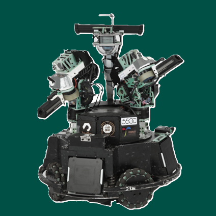
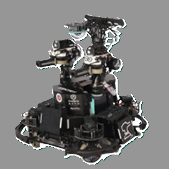
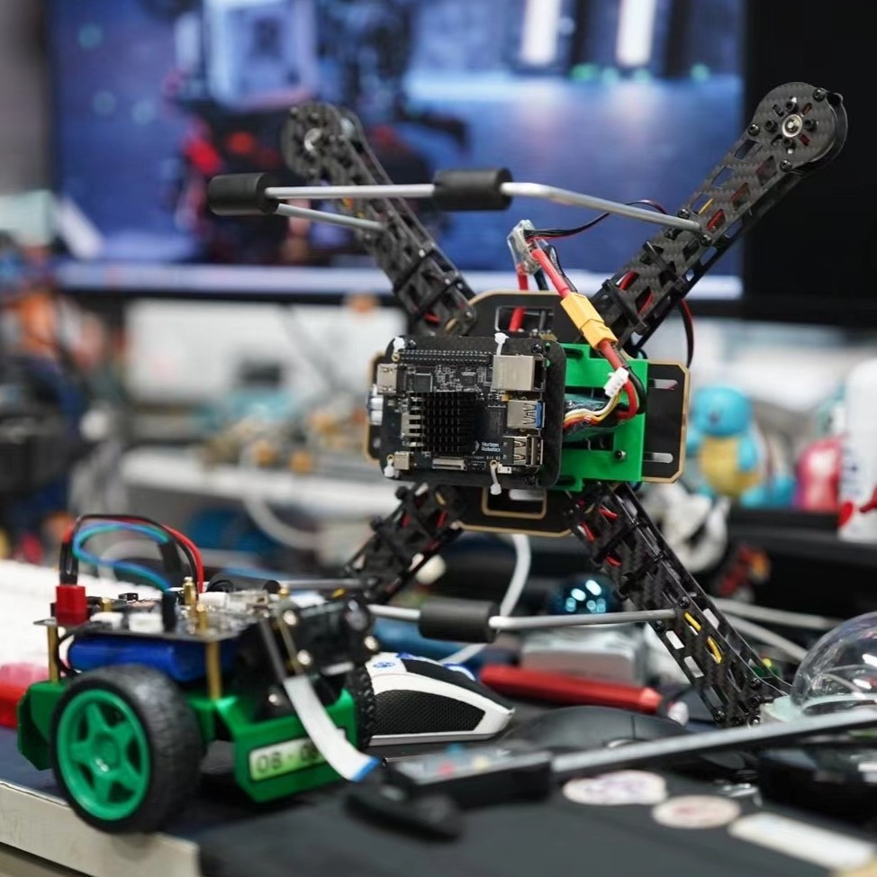
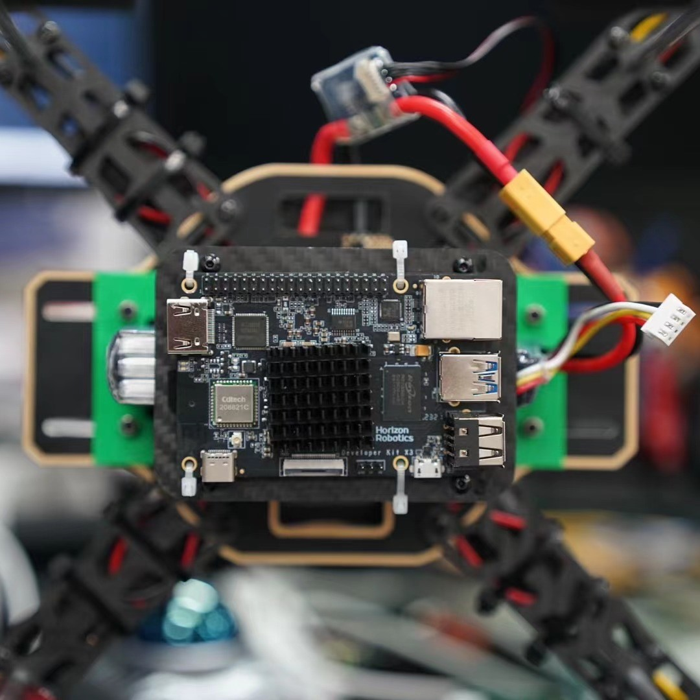
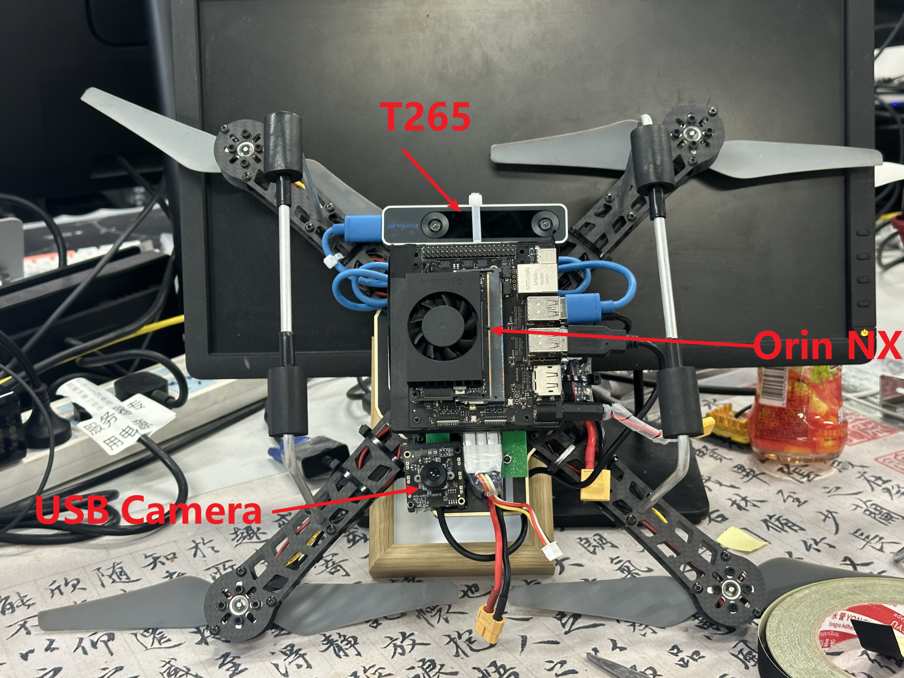
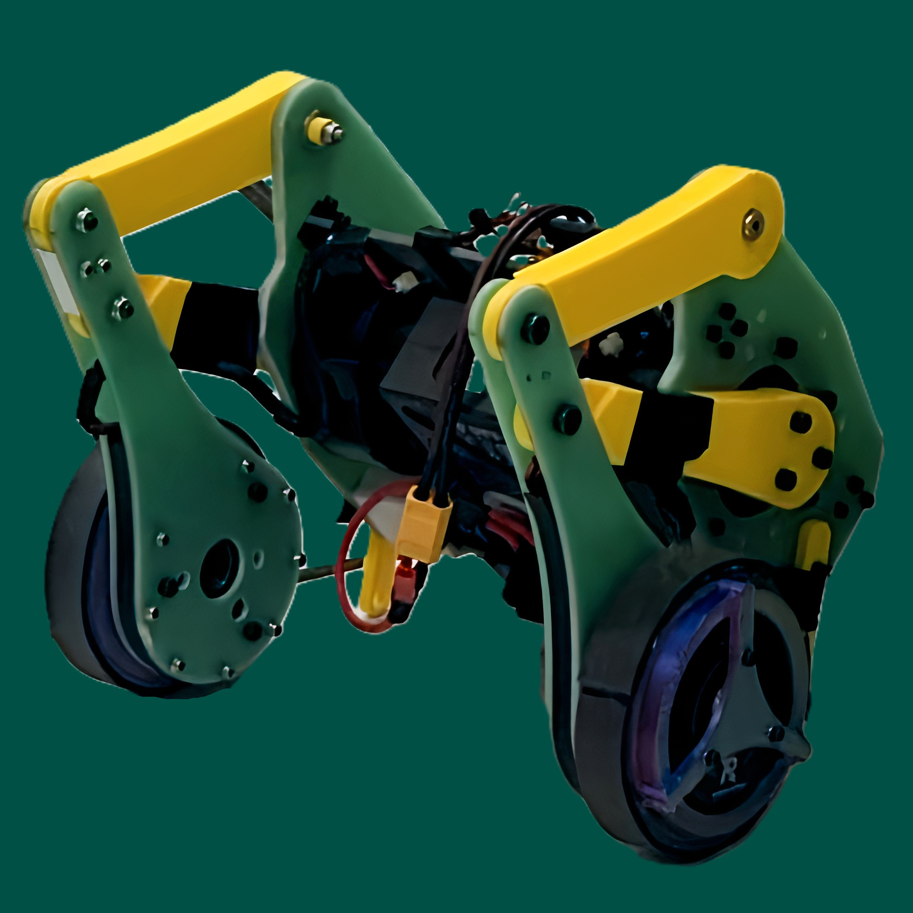
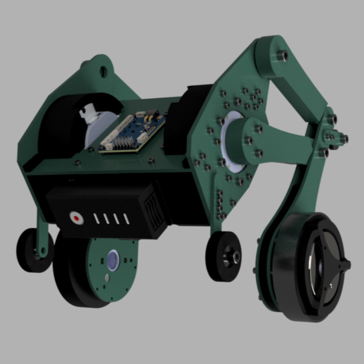
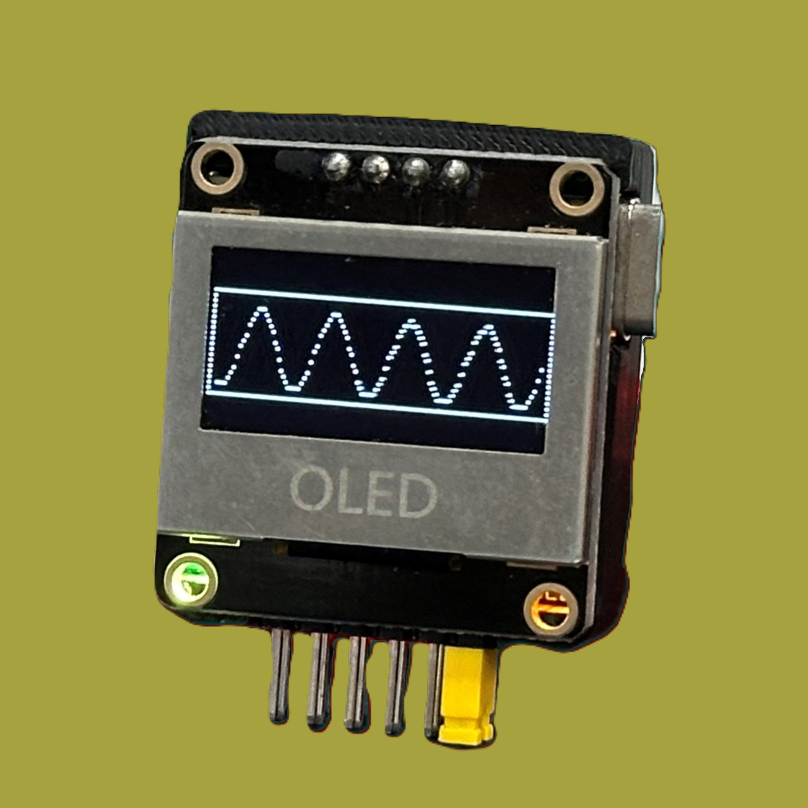
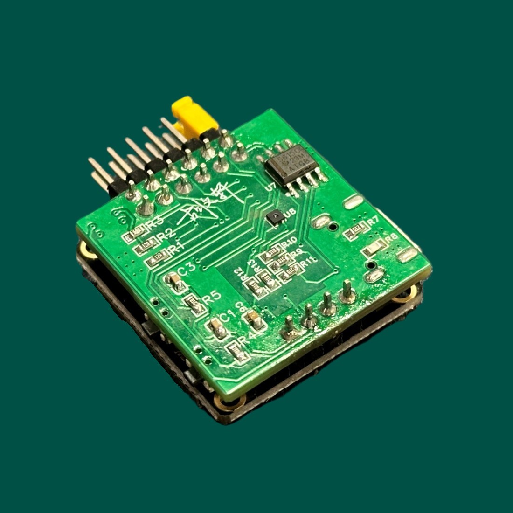

## 关于我 🙋‍♂️
欢迎来到我的 GitHub 主页！我是一个 **学生**，目前就读于[深圳大学电子信息工程学院文华班](https://ceie.szu.edu.cn/index.htm)，热衷于探索新技术和开发创新项目。

- 🔭 我目前正在做的项目：[项目名称](项目链接)
- 🌱 目前在学习：`技术/框架/语言`，如 `Rust`、`Kubernetes`
- 👯 我希望在以下方面合作：`项目类型/领域`，如 `开源数据分析项目`
- 💬 如果你有关于 `主题/技术` 的问题，欢迎与我交流
- 😄 兴趣爱好：`爱好1`，`爱好2`，`爱好3`，如 `健身`、`写博客`、`音乐`

## 我的项目 🔥

### 🌟 <a href="项目链接" style="font-size: 1.5rem; font-weight: bold; color: #0366d6; text-decoration: none;">RoboMaster Sentry</a>

  

    
    
    
  

  

    
<strong>描述：</strong>简短描述该项目的功能和特点。

    
<strong>技术栈：</strong><code>技术1</code>、<code>技术2</code>、<code>技术3</code>

    
<a href="项目列表链接" style="color: #0366d6; text-decoration: none; font-weight: bold;">更多项目请查看：项目列表链接</a>

  

---

### 🌟 <a href="https://github.com/hwwx/TrackQuad" style="font-size: 1.5rem; font-weight: bold; color: #0366d6; text-decoration: none;">TrackQuad</a>

  

    
    
    
  

  

    
<strong>Description:</strong>TrackQuad is a quadrotor UAV specifically designed for target-tracking missions, equipped with the PX4 flight control system and developed on Horizon Robotics' X3 Pi platform. It features advanced capabilities such as intelligent tracking and visual stabilization.

    
<strong>Key Features:</strong>

    <ul style="line-height: 1.6; padding-left: 20px;">
      <li><strong>PX4 Flight Control System:</strong> An open-source system that gives TrackQuad flexible and stable flight control, adapting to various flight tasks.</li>
      <li><strong>X3 Pi Development Platform:</strong> Powered by Horizon Robotics' X3 Pi processor, providing robust computational power for efficient target detection and tracking.</li>
      <li><strong>Intelligent Tracking:</strong> Utilizes YOLOV5 for autonomous identification and continuous tracking of moving targets, even in complex environments.</li>
      <li><strong>Visual Stabilization:</strong> Equipped with T265 for pose fusion with PX4, maintaining stable flight posture across diverse environments and enhancing monitoring quality.</li>
    </ul>
    
  

---

### 🌟 <a href="https://github.com/hwwx/JumpBot" style="font-size: 1.5rem; font-weight: bold; color: #0366d6; text-decoration: none;">JumpBot</a>

  

    
    
  

  

    
<strong>Description:</strong> This project is aimed at designing a miniaturized, integrated multifunctional intelligent terminal. Key features include:

    <ul style="line-height: 1.6;">
      <li>High-precision attitude sensing</li>
      <li>Intelligent device control</li>
      <li>Wireless sensor capabilities</li>
      <li>Intelligent temperature monitoring</li>
      <li>Portable DDS system</li>
      <li>Simple oscilloscope</li>
    </ul>
    
<strong>Technology stack:</strong><code>技术1</code>、<code>技术2</code>、<code>技术3</code>

  

---

### 🌟 <a href="https://github.com/hwwx/HwxLink" style="font-size: 1.5rem; font-weight: bold; color: #0366d6; text-decoration: none;">HwxLink</a>

  

    
    
  

  

    
<strong>Description:</strong> This project is aimed at designing a miniaturized, integrated multifunctional intelligent terminal. Key features include:

    <ul style="line-height: 1.6;">
      <li>High-precision attitude sensing</li>
      <li>Intelligent device control</li>
      <li>Wireless sensor capabilities</li>
      <li>Intelligent temperature monitoring</li>
      <li>Portable DDS system</li>
      <li>Simple oscilloscope</li>
    </ul>
    
<strong>Technology stack:</strong><code>技术1</code>、<code>技术2</code>、<code>技术3</code>

  

*更多项目请查看：[项目列表链接](https://github.com/yourusername?tab=repositories)*

## 我的技术栈 🚀

**编程语言**  

**框架与库** 

 

**开发工具**  

## 联系我 📫
- 邮箱：2646238262@qq.com
- Twitter：[Twitter 个人链接](https://twitter.com/yourusername)