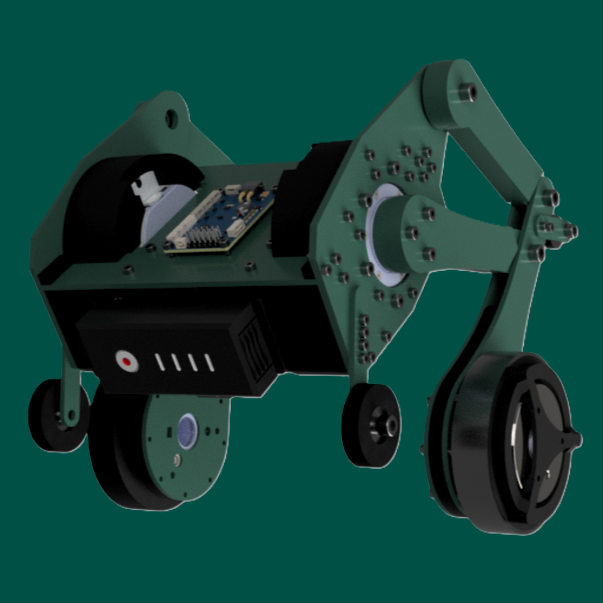

## About Me 🙋‍♂️
Welcome to my GitHub page! I am a **student** currently studying at the [College of Electronic and Information Engineering, Shenzhen University](https://ceie.szu.edu.cn/index.htm) in the Wenhua Class. I am passionate about exploring new technologies and developing innovative projects.

- 🔭 Current Project: `Preparing for Advanced Studies`
- 🌱 Currently Learning: `IELTS`
- 👯 Open to Collaborate On: `Entrepreneurship`
- 💬 Feel free to ask me about `anything`
- 😄 Hobbies: `Rubik's Cube`, `Cycling`, `Fitness`

## Project 🔥

### 🌟 <a href="https://github.com/hwwx/RP_Sentry" style="font-size: 1.5rem; font-weight: bold; color: #0366d6; text-decoration: none;">RoboMaster Sentry</a>

  

    
    
    
  

  

    
<strong>Description:</strong> This project includes two years of research and development on electronic control and navigation systems, covering:

    <ul style="line-height: 1.6; padding-left: 20px;">
      <li><strong>Electronic Control:</strong> Developed on the STM32F407VET6, including:
        <ul>
          <li>Attitude calculation from six-axis gyroscope data</li>
          <li>Motion control for the steering wheel and all-directional wheel chassis</li>
          <li>Control of a two-axis gimbal with online identification</li>
          <li>Communication across four MCU masters via CAN communication</li>
          <li>Host computer communication via serial port</li>
          <li>Function optimization for competition scenarios</li>
        </ul>
      </li>
      <li><strong>Navigation:</strong> Utilizes ROS’s Movebase framework and Point-LIO open-source algorithm for:
        <ul>
          <li>Odometry information processing</li>
          <li>Segmentation of dynamic obstacles by comparing the pre-built map with real-time point clouds</li>
          <li>Path planning and obstacle avoidance using A* and teb algorithms</li>
        </ul>
      </li>
    </ul>
  

---

### 🌟 <a href="https://github.com/hwwx/TrackQuad" style="font-size: 1.5rem; font-weight: bold; color: #0366d6; text-decoration: none;">TrackQuad</a>

  

    
    
    
  

  

    
<strong>Description:</strong>TrackQuad is a quadrotor UAV specifically designed for target-tracking missions, equipped with the PX4 flight control system and developed on Horizon Robotics' X3 Pi platform. It features advanced capabilities such as intelligent tracking and visual stabilization.

    
<strong>Key Features:</strong>

    <ul style="line-height: 1.6; padding-left: 20px;">
      <li><strong>PX4 Flight Control System:</strong> An open-source system that gives TrackQuad flexible and stable flight control, adapting to various flight tasks.</li>
      <li><strong>X3 Pi Development Platform:</strong> Powered by Horizon Robotics' X3 Pi processor, providing robust computational power for efficient target detection and tracking.</li>
      <li><strong>Intelligent Tracking:</strong> Utilizes YOLOV5 for autonomous identification and continuous tracking of moving targets, even in complex environments.</li>
      <li><strong>Visual Stabilization:</strong> Equipped with T265 for pose fusion with PX4, maintaining stable flight posture across diverse environments and enhancing monitoring quality.</li>
    </ul>
    
  

---

### 🌟 <a href="https://github.com/hwwx/JumpBot" style="font-size: 1.5rem; font-weight: bold; color: #0366d6; text-decoration: none;">JumpBot</a>

  

    
    
  

  

    
<strong>Description:</strong> JumpBot is designed with a unique structure and capabilities for flexible, interactive movement:

    <ul style="line-height: 1.6;">
      <li><strong>Four-Link Wheel-Leg Structure:</strong> JumpBot utilizes a four-link design that combines the smooth rolling of wheels with the flexible jumping capability of legs, allowing it to move easily across various surfaces.</li>
      <li><strong>Balancing Control:</strong> Equipped with an efficient self-balancing system, JumpBot maintains precise balance on its two wheels, enabling uniquely stable movement.</li>
      <li><strong>Tabletop-Level Jumping:</strong> Specially designed for flexible jumping within small areas like tabletops and counters, adding greater interactivity and fun.</li>
    </ul>
  

---

### 🌟 <a href="https://github.com/hwwx/HwxLink" style="font-size: 1.5rem; font-weight: bold; color: #0366d6; text-decoration: none;">HwxLink</a>

  

    
    
  

  

    
<strong>Description:</strong> This project is aimed at designing a miniaturized, integrated multifunctional intelligent terminal. Key features include:

    <ul style="line-height: 1.6;">
      <li>High-precision attitude sensing</li>
      <li>Intelligent device control</li>
      <li>Wireless sensor capabilities</li>
      <li>Intelligent temperature monitoring</li>
      <li>Portable DDS system</li>
      <li>Simple oscilloscope</li>
    </ul>
  

---

*More items please see:[Item list](https://github.com/hwwx?tab=repositories)*

## Technology stack: 🚀

**Programming Language**  

**Frameworks and Libraries** 

 

**Development Tool**  

## Contact Me 📫
- Mail：2646238262@qq.com